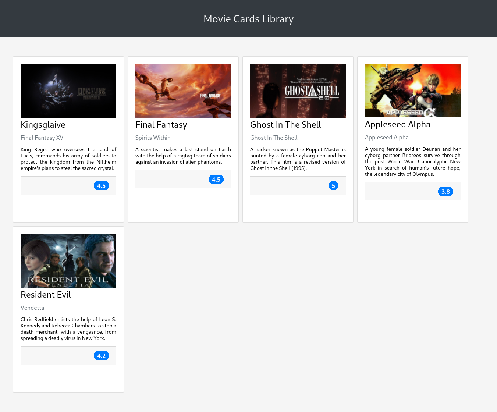

# Trybe Project Movie Cards Library 01/09/2021
 

  

 

## Habilidades

- Saber a melhor forma para instalar um gerenciador de pacotes;
- Inicializar um projeto em React;
- Utilizar JSX no React;
- Utilizar o ReactDOM.render para renderizar elementos numa página web;
- Utilizar o import para usar código externo junto ao seu;
- Criar componentes React corretamente;
- Fazer uso de props corretamente;
- Fazer composição de componentes corretamente;
- Criar múltiplos componentes dinamicamente;
- Utilizar PropTypes para checar o tipo de uma prop no uso de um componente;
- Utilizar PropTypes para garantir a presença de props obrigatórias no uso de um componente;
- Utilizar PropTypes para checar que uma prop é um objeto de formato específico;
- Utilizar PropTypes para garantir que uma prop é um array com elementos de um determinado tipo.

## Desenvolvimento
Uma [biblioteca](https://weltonthomasferreira.github.io/trybe-project-movie-cards-library/) de cartões de filmes utilizando React.

## Resultados

- `1` dia de projeto;
- `16` requisitos;
- Percentual de cumprimento de requisitos obrigatórios `100.00%`;
- Percentual de cumprimento de requisitos totais `100.00%`.

